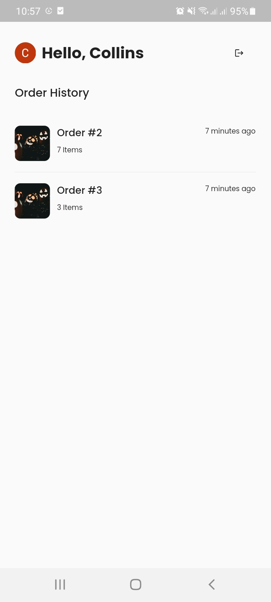
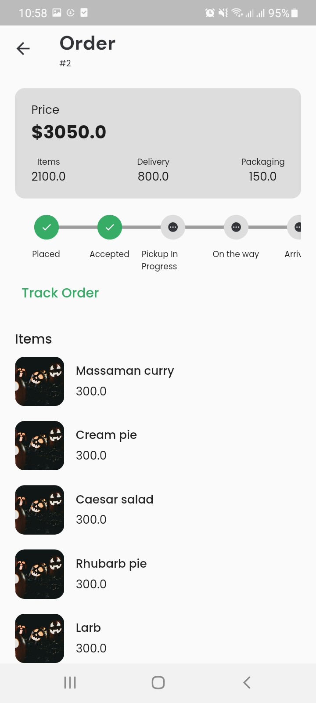
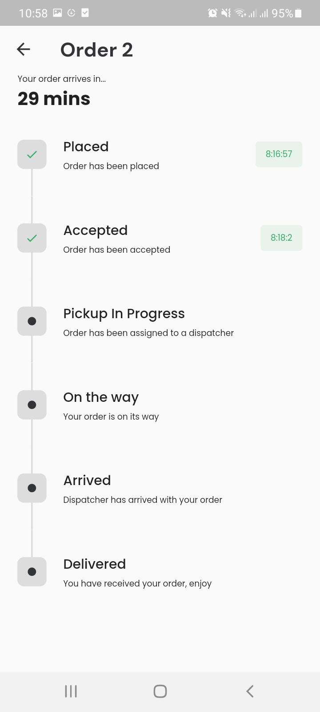

# Realtime Order Application


## Overview

The Realtime Order Application is a Flutter-based mobile app that allows users to experience a real-time order tracking system. The app leverages Ably for real-time communication, Firebase for authentication, and Riverpod for state management and dependency injection.


## How it works
The project is focused on simulating realtime updates. Since there is no active backend service or action to trigger the state of orders, I hard coded the flow by creating a timer to simulate the process of an action triggered by a backend service. Ably is used just to maintain the realtime functionality of the app. When the `OrderService` has been initialized, listeners will be created, and a method that updates the state of the order with new values every `10 seconds`, and whenever the order state has been completed, the timer gets cancelled. The callback listener from the timer that updates the state of the rorder will only be triggered when there is an active network connection, so as to avoid inconsistency with the status.
To view the realtime updates, restart the application, and click on the first order item from the homepage, it should take you to the `OrderDetails` page where you can view realtime updates of the order, and you can also click `Track Order`  to view the complete order status in realtime. Note that the action is triggered every `10 seconds`, if there is a stable internet connection, and the order has not been completed. To review the process, you will have to restart the application.

`NB: This only works for the first item in the order history, as there is not active backend to trigger such actions`

## Features

- Real-time order updates using Ably
- Firebase authentication for secure access
- Cached network images for improved performance
- Generation of fake data for testing and demonstration
- Use of Google Fonts for stylish typography
- Google Sign-In for a seamless authentication experience
- Currency formatting using `intl` package
- Timeline styling with `timeline_tile`
- Shimmer effect to indicate loading process
- TimeAgo to display the time elapsed since an activity occurred

## Dependencies

- [ably_flutter](https://pub.dev/packages/ably_flutter): ^1.2.23
- [cached_network_image](https://pub.dev/packages/cached_network_image): ^3.3.0
- [faker](https://pub.dev/packages/faker): ^2.1.0
- [firebase_auth](https://pub.dev/packages/firebase_auth): ^4.13.0
- [firebase_core](https://pub.dev/packages/firebase_core): ^2.22.0
- [flutter_riverpod](https://pub.dev/packages/flutter_riverpod): ^2.4.6
- [freezed_annotation](https://pub.dev/packages/freezed_annotation): ^2.4.1
- [google_fonts](https://pub.dev/packages/google_fonts): ^6.1.0
- [google_sign_in](https://pub.dev/packages/google_sign_in): ^6.1.6
- [intl](https://pub.dev/packages/intl): ^0.18.1
- [rxdart](https://pub.dev/packages/rxdart): ^0.27.7
- [shimmer](https://pub.dev/packages/shimmer): ^3.0.0
- [timeago](https://pub.dev/packages/timeago): ^3.6.0
- [timeline_tile](https://pub.dev/packages/timeline_tile): ^2.0.0

## Getting Started

1. Clone the repository:

   ```bash
   git clone https://github.com/yourusername/realtime-order-app.git

2. Install Dependencies
   ```bash 
   flutter pub get

3. Run the project
   ```bash 
   flutter run


## Screenshots




